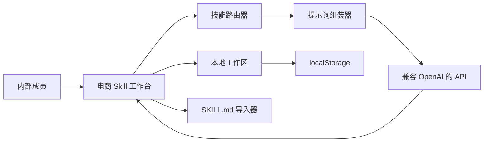

# 电商 Skill 工作台项目策划文档

## 1. 项目定位

电商 Skill 工作台是一个面向内部少数成员使用的电商 AI 能力封装页面。它把 `nexscope-ai/eCommerce-Skills` 这类 Markdown skill 仓库封装成可检索、可路由、可对话、可保存的前端应用。

项目不追求复杂后端系统，而是优先满足：
- 内部成员打开即可使用
- 轻量部署到 Vercel
- 大模型 API 前端接入
- 会话、配置、技能草稿保存到浏览器缓存
- 逻辑完整，后续可继续扩展成后端版

## 2. 背景与机会

`eCommerce-Skills` 的核心价值不是传统意义上的代码库，而是一组可复用的业务能力说明。每个技能都包含电商平台、运营场景、分析方法、输出结构和执行流程。直接把 Markdown 交给成员使用，门槛偏高；直接把全部技能一次性塞给大模型，又会造成上下文冗余和路由混乱。

因此最合理的封装方式是做一个“前端技能路由器 + 对话工作台”：
- 前端负责技能目录、检索、筛选、路由、状态保存
- 大模型负责在当前技能约束下生成具体分析和计划
- 浏览器缓存负责保存内部成员的个人工作区

## 3. 用户画像

### 3.1 运营人员
需要快速生成 listing 优化、竞品分析、增长策略、广告素材方向。

### 3.2 选品人员
需要根据平台、价格、利润、竞品情况做初筛和判断。

### 3.3 投放人员
需要生成 campaign angle、hook、素材文案、复盘总结。

### 3.4 管理者
需要让成员用统一框架输出策略，减少结果风格差异。

## 4. 产品目标

第一版目标：
- 可部署：静态前端，可推送到 GitHub 并部署 Vercel
- 可使用：没有 API 密钥也能用演示模式跑通完整流程
- 可接入：支持兼容 OpenAI Chat Completions 的接口地址
- 可保存：设置、会话、导入技能均保存在浏览器本地
- 可扩展：支持后续导入更多 `SKILL.md`

## 5. 产品边界

### 5.1 本期包含
- 技能清单目录
- 技能搜索、分类、平台筛选
- 技能详情面板
- 会话创建与切换
- 用户输入路由到合适技能
- 路由原因展示
- 大模型 API 前端直连
- API 失败或无密钥时进入演示回退
- Markdown 技能文件导入
- 工作区导入导出
- Vercel 静态部署配置

### 5.2 本期不包含
- 服务端数据库
- 多用户账号权限
- 团队共享会话
- 后端代理 API
- 真实爬虫或平台接口调用
- 复杂 agent tool calling

这些能力后续可以追加，但不应阻塞第一版上线。

## 6. 信息架构



## 7. 页面设计

### 7.1 顶部配置区
- 模型名称
- API 密钥
- 接口地址
- 保存设置
- 新会话
- 导出工作区
- 导入工作区
- 导入 Skill Markdown

### 7.2 左侧目录区
- 技能搜索
- 分类筛选
- 技能数量统计
- 技能列表
- 会话列表

### 7.3 中间执行区
- 当前技能名称和平台
- 路由/API/缓存状态
- 对话消息流
- 快捷提示词
- 输入框

### 7.4 右侧洞察区
- 技能摘要
- 能力列表
- 执行流程
- 输出格式
- 路由原因
- 当前会话统计

## 8. 数据模型

### 8.1 技能

```json
{
  "id": "ecommerce-growth-strategy",
  "name": "电商增长策略",
  "category": "strategy",
  "platform": ["Amazon", "Shopify"],
  "summary": "诊断业务健康度并生成增长路线图。",
  "triggers": ["growth", "strategy", "增长"],
  "capabilities": ["单品经济模型诊断"],
  "workflow": ["收集基线", "排序机会点"],
  "outputs": ["路线图", "KPI 检查清单"],
  "starterPrompt": "帮我生成 90 天增长路线图。",
  "systemPrompt": "你是电商增长策略顾问。"
}
```

### 8.2 会话

```json
{
  "id": "session-1",
  "title": "增长路线图",
  "skillId": "ecommerce-growth-strategy",
  "createdAt": "ISO Date",
  "updatedAt": "ISO Date",
  "messages": []
}
```

### 8.3 工作区

```json
{
  "settings": {},
  "sessions": [],
  "customSkills": [],
  "activeSkillId": "",
  "activeSessionId": "",
  "searchText": "",
  "categoryFilter": "all",
  "lastRouteReason": ""
}
```

## 9. 路由策略

第一版采用轻量规则路由：
- 匹配技能名称
- 匹配分类
- 匹配平台
- 匹配触发词
- 匹配能力描述

路由得分最高者成为当前技能。若没有匹配结果，则保留当前技能。

后续可升级为两段式路由：
1. 本地规则粗筛 3 到 5 个候选技能
2. 大模型在候选技能中做最终选择

## 10. 提示词组装策略

每次调用模型时只注入：
- 当前技能的系统提示词
- 当前技能的能力和输出要求
- 最近 8 条会话消息
- 用户最新输入

这样可以控制上下文体积，也能避免全部技能同时进入提示词。

## 11. 存储策略

第一版使用 localStorage：
- 设置
- API 密钥
- 会话
- 自定义技能
- 路由状态

后续会话变多时升级 IndexedDB：
- 大量历史消息
- 上传文件
- 执行日志
- 版本快照

## 12. 部署策略

项目使用静态前端部署：
- GitHub 仓库：`goog205118-art/amz-walm-skill`
- 部署平台：Vercel
- 构建方式：`npm run build`
- 输出目录：`dist`

构建脚本只复制静态文件，不引入复杂框架。

## 13. 风险与对策

| 风险 | 对策 |
| --- | --- |
| 前端暴露 API Key | 明确仅内部使用；后续可加后端代理 |
| 技能格式不统一 | 先用解析器尽力提取，再允许人工编辑 |
| localStorage 容量有限 | 第二阶段升级 IndexedDB |
| API 不可用 | 演示回退保持流程可演示 |
| Vercel 静态部署路径问题 | 使用 `vercel.json` 指定 output |

## 14. 验收标准

第一版完成时必须满足：
- 首页可正常打开
- 能搜索技能
- 能筛选分类
- 能查看技能详情
- 能创建会话
- 能发送消息
- 能显示路由原因
- 能保存设置和历史
- 能导入导出工作区
- 能导入 `SKILL.md`
- 能执行 Vercel build
- 能推送到 GitHub 仓库
